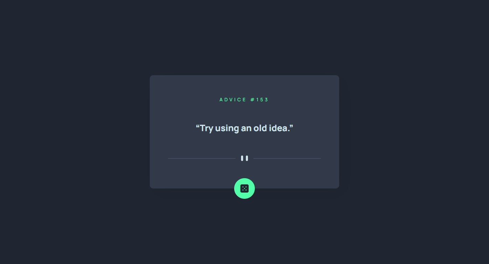

# Frontend Mentor - Advice generator app

## Overview

The challenge is to build out this advice generator app using the [Advice Slip API](https://api.adviceslip.com) and get it looking as close to the design as possible.

-  View the optimal layout for the app depending on their device's screen size
-  See hover states for all interactive elements on the page
-  Generate a new piece of advice by clicking the dice icon

### Screenshot

### Links

-  Solution URL: [Solution URL here](TBC)
-  Live Site URL: [Live site URL here](TBC)

### Built with

-  Semantic HTML5 markup
-  CSS custom properties
-  Flexbox
-  Grid
-  Mobile-first workflow
-  [Typescript](https://www.typescriptlang.org/)
-  [Sass](https://sass-lang.com/)

### Useful resources

-  [Mozilla developers resources](https://developer.mozilla.org/)

## Author

-  Frontend Mentor [@malboyoo](https://www.frontendmentor.io/profile/malboyoo)
-  LinkedIn [Thibaut Lefevre](https://www.linkedin.com/in/thibaut-lefevre-b60101117/)
